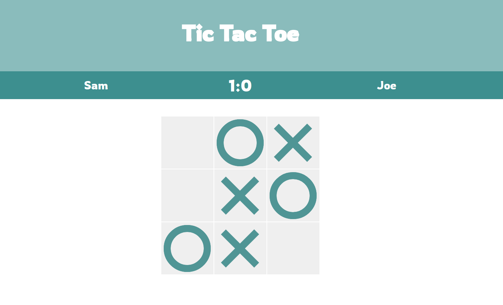

# Tic Tac Toe

- [Live Demo](https://bayoura.github.io/tic-tac-toe/)

First, I built the game as good as I could on my own. It worked fine, but I wasn't completely satisfied with it, since I knew that there were better ways of doing it. I decided to watch a tutorial by a professional web developer to learn how someone like that would approach this project. Finally, I reworked my own project with the knowledge of the tutorial. That way I did the task by myself at first, and then could still learn more about other (better/more efficient) ways of doing it. In my opinion this helps quite a bit to start thinking more like a programmer. 

This is the tutorial I watched: https://www.youtube.com/watch?v=Y-GkMjUZsmM

## What I learned
- To create the player's marks, I wanted to simply change the inner text of the respective cell to either an 'x' or an 'o'. This worked, of course, but it wasn't ideal. You have to think about the font-size, and according to the browser somebody is using it will always look different. So, I used CSS to create the shapes. By doing that, I learned a lot more about pseudo-elements (::before and ::after).
- While creating the X and O shapes, I also learned about the `:not()` pseudo class, which came in very handy to exclude certain elements. At first, I wanted to use an attribute selector, which would have ensured that elements with only(!) that class would be selected (`[attribute="value"]`). Both would work fine.
- I made a better modal/result screen. In this case I didn't need a separate modal and overlay div, so I was able to make it more compact: it's stuffed into one single div which acts as the overlay, and inside it are the message and the button, both of which I would have put in a separate modal div otherwise.
- `once:true` is very convenient!
- It was very important to remove the event listeners, and then add new ones whenever a new round or a new game was started!! This was a problem I couldn't figure out for quite a while. Sometimes when clicking a cell, it would get both marks, x and o, instead of just the one whose turn it currently was. This, of course, broke the game, but it was difficult to pinpoint why it happened (or when it would happen) because it seemed completely random. After a while it became clear, that it only happened when a new round was started, and only those cells were affected, which weren't clicked in the first round. They basically had two event listeners, which got fired both at the same time. So it's essential to refresh the event listeners after each round.

I might come back to this to create an AI so that the player can compete against a computer.